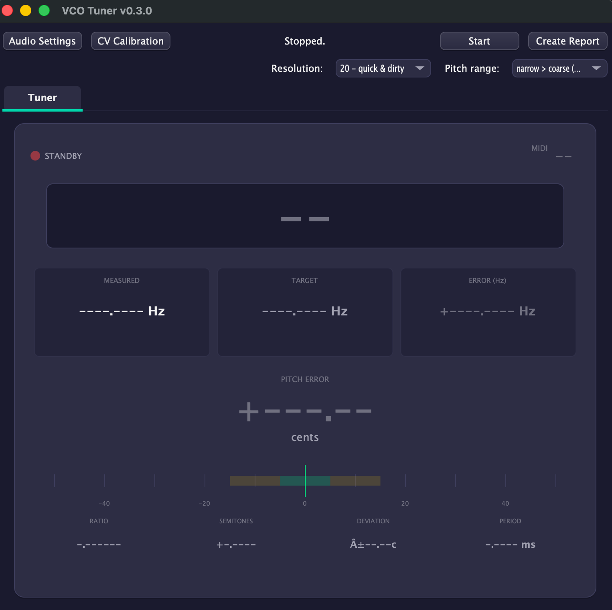

# VCOTuner

[](https://github.com/Ziforge/VCOTuner/actions/workflows/build.yml)

A JUCE-based precision tuner for VCOs, VCFs and other analog gear. Runs on Windows, macOS (including Sequoia 15.x), and Linux.



## Features

- **Scientific Tuner Display** - High-precision frequency measurement with Hz and cents error display
- **Tabbed Interface** - Separate Tuner and Chart views
- **Pitch Tracking** - Real-time frequency detection with deviation meter
- **Tuning Reports** - Export measurements as PNG with device info

This is a fork of [TheSlowGrowth/VCOTuner](https://github.com/TheSlowGrowth/VCOTuner) updated for modern macOS compatibility.

## How It Works

Traditional VCO tuning requires constant back-and-forth between fine tune and trimmer adjustments. VCOTuner eliminates this by:

1. Outputting MIDI notes across a selectable range
2. Measuring the actual frequency for each note
3. Using a center reference pitch so you can focus solely on trimmer adjustments

Tuning takes minutes instead of hours.

## Download

[Head over to the "release" section of this repository to download the latest release.](https://github.com/Ziforge/VCOTuner/releases/latest)

## Building from Source

### Prerequisites

- CMake 3.12 or later
- C++17 compatible compiler
- Platform-specific dependencies (see below)

### macOS

```bash
git clone --recursive https://github.com/Ziforge/VCOTuner.git
cd VCOTuner
cmake -B build -DCMAKE_BUILD_TYPE=Release
cmake --build build
```

The built app will be in `build/VCOTuner_artefacts/Release/VCOTuner.app`

### Windows

```bash
git clone --recursive https://github.com/Ziforge/VCOTuner.git
cd VCOTuner
cmake -B build -DCMAKE_BUILD_TYPE=Release
cmake --build build --config Release
```

### Linux

Install dependencies first:

```bash
sudo apt-get install libasound2-dev libcurl4-openssl-dev libfreetype6-dev \
    libx11-dev libxcomposite-dev libxcursor-dev libxinerama-dev \
    libxrandr-dev libxrender-dev libwebkit2gtk-4.1-dev
```

Then build:

```bash
git clone --recursive https://github.com/Ziforge/VCOTuner.git
cd VCOTuner
cmake -B build -DCMAKE_BUILD_TYPE=Release
cmake --build build
```

## Issues

[Report bugs or request features here](https://github.com/Ziforge/VCOTuner/issues)

## Credits

Original application by [TheSlowGrowth](https://github.com/TheSlowGrowth/VCOTuner)
