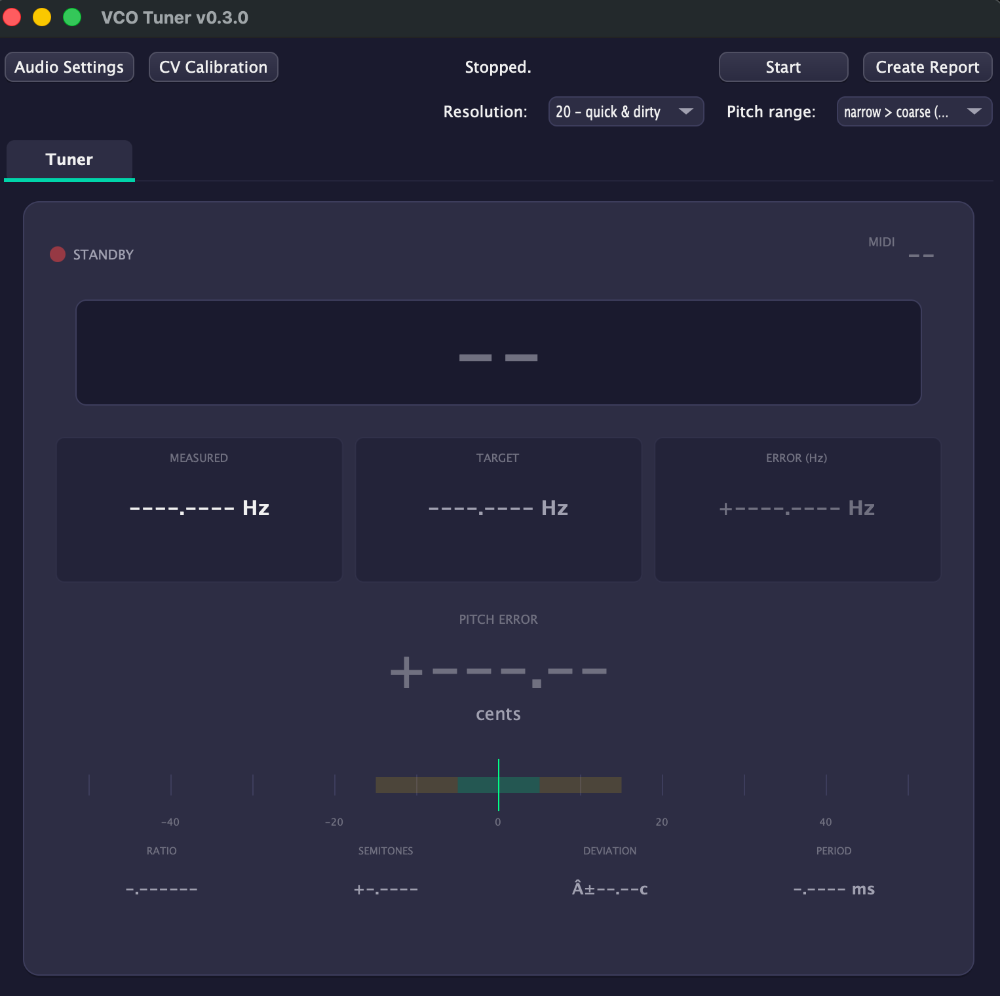

# VCOTuner

[](https://github.com/Ziforge/VCOTuner/actions/workflows/build.yml)

A fork of [TheSlowGrowth/VCOTuner](https://github.com/TheSlowGrowth/VCOTuner) that adds direct CV output and calibration, and merges the reworked measurement code from [TimoRozendal/VCOTuner](https://github.com/TimoRozendal/VCOTuner) — see [What's new](#whats-new).

A JUCE-based precision tuner for VCOs, VCFs and other analog gear. Runs on Windows, macOS (including Sequoia 15.x), and Linux.



## Status: work in progress, not yet validated on hardware

**None of what this fork adds has been checked against a real oscillator yet.**
The MIDI-driven tuner underneath is the original application and has been used
for years; everything listed below it is new here. It builds on macOS, Windows
and Linux in CI and passes its own test suite, but a passing test is not a tuned
VCO. Treat the new parts as unproven until they have been used on hardware —
including by me.

| | state |
|---|---|
| CV output driving a sweep | **never driven a real oscillator.** Implemented, and exercised end to end in software only |
| Sample-rate calibration | measured against a real audio interface (−5.8 ppm on the development machine); its effect on tuning accuracy is unverified against a known reference |
| Dropout repair, trigger-level tracking | verified against synthetic signals in the test suite; not yet seen a real drifting VCO |
| macOS build | run on real hardware |
| Windows and Linux builds | compile in CI, never run at all |

The CV settling allowance is 100 ms, inherited from the MIDI-to-CV path. If CV
tracking reads consistently flat or sharp at the start of each note, that is the
first number to change.

Reports from anyone who does patch it to hardware are very welcome.

## Features

- **CV output** - drives the oscillator directly from a DC-coupled audio output, so no MIDI-to-CV interface sits in the measurement chain *(untested on hardware — see Status)*
- **CV calibration** - 1V/oct and Hz/V, Expert Sleepers and MOTU presets, with export to CSV, JSON and Ornament & Crime *(untested on hardware)*
- **Sample-rate calibration** - measures the converter's true rate, so absolute frequency readings are not out by the interface's ppm error
- **Scientific Tuner Display** - High-precision frequency measurement with Hz and cents error display
- **Tabbed Interface** - Separate Tuner and Chart views
- **Pitch Tracking** - Real-time frequency detection with deviation meter
- **Tuning Reports** - Export measurements as PNG with device info

## How It Works

Traditional VCO tuning requires constant back-and-forth between fine tune and trimmer adjustments. VCOTuner eliminates this by:

1. Playing a series of pitches across a selectable range
2. Measuring the actual frequency for each one
3. Using a centre reference pitch so you can focus solely on trimmer adjustments

Tuning takes minutes instead of hours.

The pitch can come from either source, selectable in the main window:

- **MIDI out** — sends MIDI notes for an external MIDI-to-CV interface to convert. This is how the original works, and the path that has actually been used on hardware.
- **CV output** — sets a voltage on a DC-coupled audio output directly. This removes a second converter, with its own scaling error, from the measurement chain. **Not yet tested against a real oscillator.**

## What's new

**Measurements are much more accurate.** The app finds each zero crossing more precisely than the sample rate alone allows, by interpolating between the two samples either side of it. That calculation was wrong — it mirrored the result within the sample interval, which added roughly *twice* as much timing jitter as doing no interpolation at all. With it fixed, the jitter at 440 Hz drops from about a third of a sample to essentially nothing.

You'll notice this as **error bars that mostly aren't there any more**. The old build drew bands tens of cents wide on a perfectly good oscillator. The uncertainty is now so much smaller than that it falls below a single pixel on a steady signal, so no band is drawn at all.

The band reappears the moment the pitch genuinely moves — turn a tuning trimmer while a sweep is running and you'll watch it grow, then collapse again when you let go. So read it this way: **no band means the reading is settled and trustworthy; a visible band means the pitch is still moving.**

**The error bars were also measuring the wrong thing.** They showed the spread of the individual period readings rather than the uncertainty of the averaged result that's actually plotted. They now show the uncertainty of the number on screen.

**A bad note no longer ruins the whole sweep.** Any note that failed to measure used to pop up a dialog and stop the run. Now it's marked on the graph with an orange "×", named in a status line beneath it, and the sweep carries on. Fix the cause mid-run — tweak a trimmer, reseat a cable — and that note goes back to normal on the next pass.

Live tuning never interrupts you with a dialog at all. Report mode shows a single summary at the end listing anything that failed. Errors that genuinely mean nothing can work — no MIDI device selected, the audio device disappearing, the MIDI-to-CV interface not responding — still stop the run and tell you why.

**Far fewer false "unstable signal" errors.** The old detector triggered on a fixed threshold at zero with no noise immunity, so noise or a DC offset on the input produced several false triggers per cycle — on a noisy signal it could find 609 crossings where 220 was correct. That's what produced the "zero crossings ... don't seem to be coming in at a constant rate" error on oscillators that sounded perfectly fine. The trigger now adapts to the measured signal level and ignores noise between its thresholds. Very quiet and very hot signals both measure correctly with no adjustment.

**High notes complete.** Each note's timeout was calculated in a way that rounded down to zero at the top of the range, so the measurement gave up before the audio could physically arrive. High notes now get a sensible minimum.

**A drifting oscillator is now flagged instead of quietly measured.** The stability check used to confirm the signal was steady across five consecutive cycles and then never look again — so an oscillator that drifted after that point was still reported as a confident reading. It now re-checks the whole measurement before accepting it.

One thing to expect from that: a note whose capture contains an audible click or dropout will now be marked as failed rather than absorbed into a wider error bar. At the highest resolution setting, where each note is measured over hundreds of cycles, a single glitch anywhere in the capture is enough to do it. That's deliberate — a flagged note is more useful than a plausible wrong number — but if you start seeing failures where you didn't before, suspect the audio path before the oscillator.

**Runs on current macOS.** Updated to JUCE 8, which removes the build workarounds previously needed on macOS 15 and later.

## Download

[Head over to the "release" section of this repository to download the latest release.](https://github.com/Ziforge/VCOTuner/releases/latest)

macOS downloads are not signed by Apple, so Gatekeeper will refuse to open them and claim the app is damaged. It isn't — right-click the app and choose Open, or clear the quarantine flag:

```
xattr -dr com.apple.quarantine VCOTuner.app
```

## Building from Source

### Prerequisites

- CMake 3.22 or later
- C++17 compatible compiler
- Platform-specific dependencies (see below)

### macOS

```bash
git clone --recursive https://github.com/Ziforge/VCOTuner.git
cd VCOTuner
cmake -B build -DCMAKE_BUILD_TYPE=Release
cmake --build build
```

The built app will be in `build/VCOTuner_artefacts/Release/VCOTuner.app`

### Windows

```bash
git clone --recursive https://github.com/Ziforge/VCOTuner.git
cd VCOTuner
cmake -B build -DCMAKE_BUILD_TYPE=Release
cmake --build build --config Release
```

### Linux

Install dependencies first:

```bash
sudo apt-get install libasound2-dev libcurl4-openssl-dev libfreetype6-dev \
    libx11-dev libxcomposite-dev libxcursor-dev libxinerama-dev \
    libxrandr-dev libxrender-dev libwebkit2gtk-4.1-dev
```

Then build:

```bash
git clone --recursive https://github.com/Ziforge/VCOTuner.git
cd VCOTuner
cmake -B build -DCMAKE_BUILD_TYPE=Release
cmake --build build
```

## Tests

The measurement code has an automated test suite. It is not built by default:

```bash
cmake -B build -DVCOTUNER_BUILD_TESTS=ON
cmake --build build
ctest --test-dir build
```

## Issues

[Report bugs or request features here](https://github.com/Ziforge/VCOTuner/issues)

## Are you on ModWiggler?

[Here's a thread on ModWiggler. Post your tuning reports here, if you like](https://www.modwiggler.com/forum/viewtopic.php?p=2276045)

## Credits

Original application by [TheSlowGrowth](https://github.com/TheSlowGrowth/VCOTuner).
Measurement accuracy and robustness rework by [TimoRozendal](https://github.com/TimoRozendal/VCOTuner).
